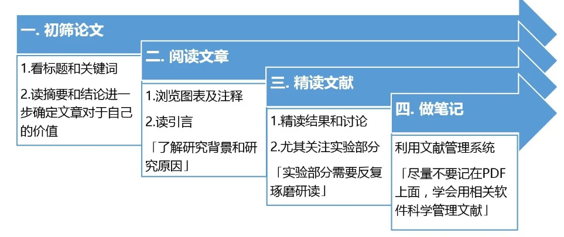

李沐提倡“读三遍”。

第一遍粗筛论文；第二遍精筛论文，保留适合自己的且高质量的论文；第三遍是最后一遍，精读论文。

+ 第一遍：只看论文的**Title, Authors**、**Abstract**和**Conclusion**的内容，以及方法设计和测试结果中的图表。这一遍下来有了对论文研究什么问题，使用什么方法，效果怎么样有了初步的把握。根据论文与自己方向的契合程度以及方法和结果的质量决定是否要读第二遍。

+ 第二遍：从头开始快速浏览论文，不必深究细节，在第一遍的基础上进一步对论文要解决的问题、方法的构想、测试的效果进行了解。如果实在对其涉及的领域或提到的技术不了解，可以在阅读的过程中圈出不熟悉的技术、术语以及相关的参考文献标号，使用DFS进行对相关技术、术语进行了解，对相关引用文献进行阅读，以对论文做的事有一个较准确的评估。最后结合论文的方向和质量判断是否了解到这个程度就足够了，如果论文质量高并且和自己方向高度契合，或者自己很干兴趣，就读第三遍。

+ 第三遍：真·精读。逐字阅读，领会其每个单词、每段话的含义与目的。同时将自己带入，想想自己如果正在进行这项研究，会怎么做，和论文作者相比怎么样，论文未实现的目标自己是否有更好的想法。

### 参考文献

* [如何阅读论文](https://www.zhihu.com/question/304334959/answer/553782865)