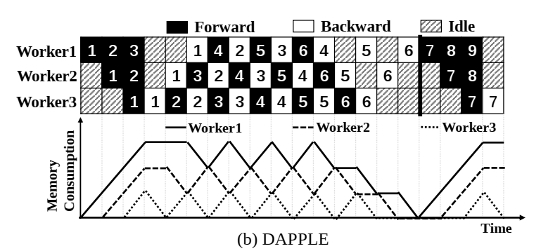
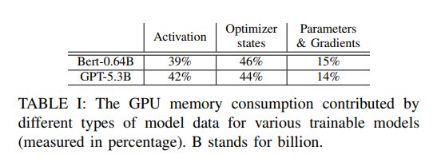
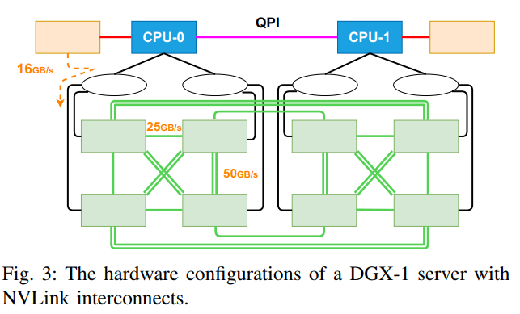
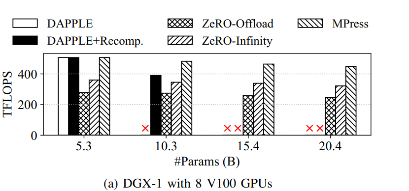
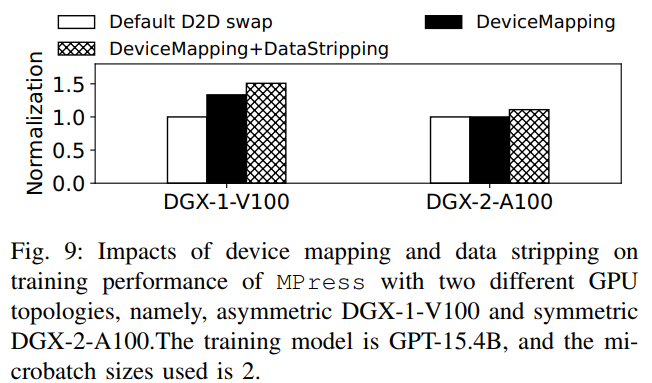
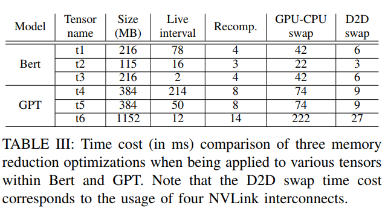

# MPress精读的个人理解

## 标题和作者

+ 标题：通过节约内存的操作级并行使在多GPU的一个服务器上训练十亿参数规模的模型成为可能

+ 作者：第一作者是Quan Zhou，通讯作者是李诚老师；他们都来自USTC。

## Abstract

是**Introduction**的概括版，内容一致。

## Introduction

### 背景介绍

研究证明，模型参数越多，模型效果越好。模型参数越多，训练时对GPU显存要求越高。单个GPU的显存不够，需要多个GPU并行计算。

本文面向的环境是在多GPU的单服务器上训练十亿参数规模的DNN。原因有二：
* 这个规模的DNN大部分情况下够用了。
* 单服务器下性能的提升可以作为多服务器性能提升的基础。

### 目前存在的问题

目前多GPU的单服务器的所有显存加起来也不够训练十亿参数级别的模型。因为要同时存储模型参数，梯度等中间计算结果以及优化器的状态等各种数据。

### 当前已提出方法及其局限

**最基本的思想：分布式** 

* 在数据级和操作级的粒度上对模型训练的计算任务进行切分，将这些计算任务分配给多个GPU。这样内存负担也分摊到多个GPU上了。
    * 显存的扩增速度远小于模型训练需求的增长速度，单使用这种技术依然会出现显存不够用的问题。

**进一步减小内存负载的技术**

* 重计算，本来前向传播时的各层张量都要保存，现在保存一部分检查点，反向传播计算梯度时需要了再从检查点重新计算这些张量。
    * 以时间换空间，性价较高。不过存在二次计算引入的开销，且只能减小隐藏层中间计算结果（约占模型数据的50%）的存储开销。

* GPU-CPU交换，重计算只能省去中间张量的空间，这种方式什么数据的空间都能省。
    * 因总线带宽有限，即使可以与GPU计算并行执行，依然有不小的等待传输的时延。

* ZeRO是微软提出的一种深度学习训练技术，它通过消除数据并行训练中的冗余，并结合前两种技术来节约显存。
    * GPU间通信的开销较大（主要是因为非常频繁的GPU间通信来分享分布式存储的模型数据）。

### 本文提出的方案

本文提出的MPress将ZeRO用的数据级并行改为操作间并行以减少GPU间通信来提高性能（GPU间通信需求少是操作间并行固有的优势）。

在操作级并行的过程中存在GPU显存利用不均的现象，执行流水线前几个阶段的GPU内存负载高得多。而现有的多GPU系统的GPU间带宽很大，因此分担负载的传输开销是可以接受的。

因此，本文提出D2D swap来利用GPU间互联的高带宽将内存告急的GPU的压力转移给内存空闲的GPU。具体实现上，利用加权数据分片并行来提高传输速度，用stage-device map来调度内存负载。最终这种技术可以压缩显存使用量，提高训练效率。

而GPU的显存有限 为了进一步利用内存资源，还是要用到重计算和CPU-GPU交换。为了平衡内存节约与随之而来的开销，本文使用一个决策模型，根据关键指标来进行相关参数的自适应配置。

> *批注：当精读过一遍后回头来看，这一部分十分凝练精确地概述的论文创新的全部内容。*

### 测试效果

把MPress植入到两个常用而结构不同的操作级并行系统中，训练两个代表性的DNN（BERT和GPT）。测试结果是，在相同设备上可以训练的模型比使用重计算技术时大2倍左右；训练相同大小的模型时，比ZeRO系列快2倍左右。

> *批注：这里最好列出在合适的环境下和SOTA对比的表现提升百分比。*

## Background and Motivation

### DNN的并行训练方式选择

DNN训练很耗资源，并行训练可以提高效率，充分利用计算资源。根据并行粒度可以分为如下三类：

* 数据并行
* 模型并行
* 流水线并行

这种划分抽象，难以理解。另有理论根据并行粒度进行了更合理的分类：

* 操作内并行（如数据级并行）
* 操作间并行（如指令流水线）

操作内并行指许多GPU对分配给自己的张量片段进行相同的运算；操作间并行和CPU中的流水线类似，不同GPU负责神经网络不同层的运算，将这些运算看作指令执行过程中的各阶段，重叠起来形成神经网络版流水线。。

当神经网络规模达到十亿参数时，GPU显存成为瓶颈，使用上述并行算法时显存会爆。

本文挑选操作间并行作为优化起点，原因如下：

* 数据并行在执行时每个GPU里都要存相同的模型数据来进行计算，存在存储冗余；GPU间要周期性地交互模型参数，来保证每个GPU上的模型都一致且最新，通信开销大。
* 操作内并行采用分配-聚合的方式为GPU们分配任务，这样在数据收集与聚合时首先存在大量通信开销，且当数据完全聚合后才能进行下一步，引入了同步等待的开销。
* 操作间并行通信开销小得多，且工业界和学术界已有操作间并行训练的实现。因此，它的理论开销最小，而且不存在存储冗余问题。

> *批注：这一段概括了模型并行训练技术的背景以及选择操作间并行训练作为优化基础的原因。*

### 操作间并行具体示例

我们把GPU叫做Worker，每个Worker负责神经网络连续几层的前向或反向传播，每一时间步认为可以完成一个microbatch的计算量。

<h5 id ="DAPPLE流水线示例">DAPPLE流水线示例</h5>

上图中的数字是microbatch号。可以看到，Worker1-3相继进行microbatch1的各层计算，而且对不同microbatch不同层的计算可以重叠。

> *批注：这一段结合图片简洁生动地阐释了论文优化的基础——操作间并行训练的原理与运行过程。*

### 不作优化时的GPU显存使用情况

朴素的操作间并行的训练过程中，GPU们的显存使用情况是怎么样的呢？作者在亚马逊的云服务器（$ 8 \times V100$）上部署了两个代表性的操作间并行训练系统（PipeDream和DAPPLE），并在上面训练两个代表性的DNN模型（Bert和GPT）。在训练的过程中检测各GPU的显存使用情况。流水线的阶段划分使用系统推荐的策略（以各阶段的计算量差不多为目标，这样流水线运作时不会有明显的瓶颈阶段）。

#### 可稳定训练的最大模型大小

首先，microbatch越大，训练时需要占用的显存越多。当microbatch为2时，PipeDream上最多可以训练2B参数的Bert；DAPPLE上最多可以训练5.3B参数的GPT。

> *批注：microbatch不同，显存负载不同；模型不同，计算过程不同；因此评估阶段对PipeDream和DAPPLE的表现差异的评估还应考虑以上两个差异。*

因为PipeDream使用异步调度策略（“异步”指不同minibatch的microbatch可以同时进行计算；如果是同步调度策略，一个minibatch完全完成后，下一个minibatch的microbatch才能载入GPU开始计算，如[DAPPLE流水线示例](#DAPPLE流水线示例)），这样的话并行度更高，但是GPU中保存的模型版本也越多。比如microbatch#7在Worker1上用的是microbatch#4反向传播梯度下降完成后的模型计算的，而Worker2已经完成了microbatch#5的反向传播与梯度下降，为了前向传播microbatch#7，Worker2需要保存和它在Worker1上处理的模型相同的模型数据，这样GPU显存中就需要保存多个版本的模型数据了。

#### 不同类型的模型数据负载

下表展示了不同类型的模型数据在显存中的负载占比。

<h5 id ="不同类型的模型数据负载">不同类型的模型数据负载</h5>

我们的目标就是找到以可接受的开销来压缩这些数据的方法，以在相同平台上性能不减地训练更大的模型。

#### 不同GPU的显存开销差异

不同的GPU负责神经网络不同阶段的计算，它们的显存负载是否存在差异？如果存在，是什么原因？下图是训练过程中各GPU显存负载情况。

<h5 id ="各GPU显存负载">各GPU显存负载</h5>

可以看到存在明显的显存负载不均，负载流水线前期计算任务的GPU负载远大于后期的。这样的话，增加batch或model的大小都会引起GPU报out-of-memory（OOM），即使部分GPU实际上负载并不大。

**为什么在操作间并行的训练过程中会出现负载不均的问题呢？**

可以再次参考[DAPPLE流水线示例](#DAPPLE流水线示例)，Worker1的显存始终是最大的。

原因是前向传播时中间层的张量计算中间结果在反向传播梯度计算时要用，所以在对应阶段的反向传播完成前这些中间结果要一直保存在显存中。

而位于流水线上游的GPU前向传播计算最早，对应的反向传播计算最晚，中间间隔的时间步越多，而这些时间计算的其他microbatch的中间层张量同样要保存在显存中，因此显存负载比位于流水线下游的GPU要大得多。

> *批注：这一段简要介绍了论文使用的基础操作间并行系统：PipeLine和DAPPLE，通过数据展示了在多GPU单服务器上部署这两个系统时它们的负载限制以及负载情况。基于此引出了论文主要创新点——D2D swap的灵感来源：在操作间并行系统中各阶段GPU显存负载不均，并解释了这一现象出现的原因。*

### 现有的GPU显存压缩技术

我们之前陈述了选择操作间并行作为优化基础的原因并在真机上测试了优化前的最佳表现，观测显存负载状况。我们接下来要开始构思怎么优化了。

如果将现有的SoTA显存压缩方式应用到我们的操作间并行训练系统上，性价比怎么样？

#### 调整流水线阶段划分策略为显存负载均衡

> * 这样可以解决显存负载不均。

> * 但是各GPU各自阶段的计算时间分布不均了，而流水线速率的瓶颈为运行时间最长的阶段。
> * 测试发现如此性能降低34%，代价太大。

#### 重计算
> * 以重复的计算开销换取显存的节约。性价比较高。

> * 只能减少一种类型的模型数据（占50%左右），无法压缩另50%左右的数据空间
> * 重计算需要竞争GPU资源，最多产生33%的额外时间开销。

#### GPU-CPU交换

> * 利用了CPU的内存甚至NVMe SSD的存储空间，各类模型数据都可以存。

> * 总线带宽有限，大量的张量数据传输造成的等待时延使训练吞吐量下降超过60%

#### 微软的ZeRO系列

ZeRO系列是基于数据并行训练系统进行显存压缩优化的。

> 系列的第一代，ZeRO（Zero Redundancy Optimizer），通过将模型的参数、计算的梯度以及优化器状态分布式存放在不同GPU中来减少数据存储冗余。本来数据并行要求所有GPU上存一个完整的模型，而且计算时产生的中间数据每个GPU都要存下来，这引入了大量的存储冗余。ZeRO的做法减少了冗余；但是为了计算时获取完整的模型以及所需的中间数据，GPU间需要大量的通信来获取自己显存上未存储的信息。
> 
> 系列的第二代，ZeRO-Offload，将优化器状态数据的存储以及关联的计算任务让渡给CPU。但它不支持异步调度策略（不同minibatch的microbatch同时计算），因为要计算不同minibatch的microbatch，首先GPU要存不同版本的模型数据，GPU-GPU、GPU-CPU间通信的数据也更多，这会导致GPU-CPU总线的带宽不够用。
> 
> 最新的一代，ZeRO-Infinity，进一步利用了CPU以及NVMe SSD之类的辅存。
> 

ZeRO系列可以显著提升在多GPU单服务器上训练的模型大小，但是引入的GPU-GPU、GPU-CPU通信开销不容忽视。

> *批注：这一段详细列述了可以被称为SOTA的显存压缩技术，介绍了其设计思想、实际效果以及实现代价。*

### 如何设计进一步的显存压缩技术——利用新兴的硬件技术

近年来设备制造商在显卡互联上使用了新型总线NVLink，相比其前辈PCIe，大大提高了传输带宽，GPU间的通信开销显著降低。

基于这个契机，本文提出D2D swap，利用GPU间总线的高带宽，将操作间并行流水线上游GPU的负载转移给下游GPU，在需要用时再转移回来。

* 相比GPU-CPU交换，由于NVLink的使用，GPU间的通信开销小得多
* 相比重计算，GPU交换不用竞争GPU的计算资源，GPU间通信的时间可以和GPU计算反向传播的时间重叠，节约时间

> *批注：这一段提出了本文的主要创新点——D2D swap设计的另一契机：新型总线带来的GPU间高速传输能力，并结合之前的显存负载不均现象，正式提出D2D swap想法，并列举了相比目前热门的显存压缩技术的优势。*

## MPress Internals

### 设计概览

作者提出了使用多种显存压缩技术的操作间并行DNN训练系统MPress来应对GPU显存墙挑战。

因为GPU带宽资源有限，D2D swap用于压缩从上一次使用/创建到下一次使用间隔小于重计算以及GPU-CPU交换最低时延的数据，以免带宽不足。

总得来说，D2D swap的offload和reload速度快（得益于NVLink的高带宽以及GPU间高度互联），而且可以与GPU的计算重叠进行。

> *批注：这一段对MPress的概念功能、包含的技术及其特色、组合策略进行了概述。*

### MPress的具体架构及工作流程

MPress主要分为static和runtime两个模块。static模块用于决定在正式训练前在哪些流水线阶段使用哪些优化技术，以达到最好的内存压缩与性能开销的平衡；runtime模块用于正式训练时的内存压缩操作执行，与操作间流水线系统共同运作。

#### Static模块

Static模块用来在正式训练前决定要对哪些数据进行优化，进行哪种优化以及何时进行优化。由profiler, planner, rewriter, emulator构成。

##### Profiler

profiler根据给定的目标模型以及batch大小进行测试性训练，目的是获取训练时产生的各张量数据的大小及其两次使用的间隔。本工作默认模型在训练时上述内容是固定不变的，有些模型在训练时各数据大小或者它们的使用间隔会动态变化，那些模型不是本工作面向的对象。总之，profiler就是用来采集模型训练时的一些静态数据的。

##### Planner

planner是一个低开销的模型，它比较对各数据采用不同压缩技术时的性能开销，来为各数据决策最合适的压缩技术，使总开销最小。

##### Rewriter

rewriter接收planner的策略，在原始的流水线操作流上，遵循逻辑依赖关系，插入显存压缩技术所需的操作，比如offload与recompute，比如GPU间交换（可以重叠），形成新的包含内存压缩操作的流水线数据流。

##### Emulator

emulator根据rewriter生成的数据流执行策略，对目标模型按指定的batch大小进行训练中的一轮更新，收集显存压缩效果或性能损失信息。

emulator将收集的测试结果返回给planner，planner将其与先前的测试结果比较，判断当前的策略配置是否接近收敛至最优策略。

若干次迭代后如果策略接近收敛，就把它传入runtime 模块用于真正的训练。

<h5 id ="MPress系统框图">MPress系统框图</h5>

根据[Static模块输出示例](#Static模块输出示例)，静态部分实际上就是进行了一个决策，决策的内容是在流水线的哪些阶段要用哪些显存压缩策略。

<h5 id ="Static模块输出示例">Static模块输出示例</h5>

Static模块进行决策的开销不算入运行时开销。因为这是在真正的训练前做的准备工作，而每次策略评估时仅进行一次模型更新迭代，若干次迭代后策略收敛，这个准备工作的开销相比真正运行时的训练开销可以忽略不计。

#### Runtime模块

根据[MPress系统框图](#MPress系统框图)，runtime模块有三个部分：

* Compaction Library: 包含了recompute（使用操作间并行系统内置的实现），D2D swap（自己创新的）和CPU-GPU交换（根据相关论文复现的）的代码实现。

* Memory Manager: 为Executor提供显存分配与释放的API。

* Executor: 非显存压缩的操作（即神经网络的前向传播和反向传播计算）直接调用现有的操作间并行系统去交付给GPUs去执行；显存压缩操作，比如（drop，swap-out）以及即将要用到相关数据时的（recompute，swap-in）操作由executor交付给相关GPUs去执行。

> *批注：这一部分分模块介绍了MPress系统的结构，包括模块的功能、算法逻辑或实现方式。*

### D2D Swap的具体介绍

D2D Swap是本文的主要创新点，所以这一部分详述了该想法实现面临的挑战及应对方案。

D2D Swap理论上可以通过GPU间高带宽的链路以较小的开销平衡GPU的显存负载。具体实现时存在这两点问题：

* 不同的上游-下游GPU对（即存在数据互换关系的GPU对）间的链路数量与每条链路的带宽可能不同。意味着不同GPU对的可互换的量及互换时的开销不同。是统一与最小链路带宽的GPU对看齐（这会导致部分带宽的浪费）还是存在某种自适应的互换数据量决策算法？

* 在训练过程中不同上游GPU的swap-out需求不同，不同下游GPU的显存spare space不同。如何保证在某上游GPU存在一定量的swap-out需求时，与之互联的下游GPU能提供充足的spare space并且互联链路能提供较大的带宽？这个问题其实就是如何为非对称拓扑结构中的GPU分配操作间并行的流水线阶段使上游阶段的GPU的可达下游GPU足够且传输开销最小的问题。

本文应对挑战的核心思想有两点：Data stripping和Device mapping。

#### Data stripping

Data stripping可以保证链路异构时依然能最大限度地利用各链路带宽。

一个GPU可以与多个其他GPU互联，因此可以将负载同时分担给多个GPU。

DGX-2架构的服务器的GPU是全连接并且所有链路都相同。这种环境下，上游GPU可以把要offload的张量切分成相同大小的子块（子块数量和与该GPU互联的可以帮忙分担负载的GPU数相同）然后转移到多个其他GPU上。

DGX-1架构的服务器的GPU互联拓扑结构是非对称的，GPU间的链路数量与带宽存在差异。

<h5 id ="DGX-1的GPU互联拓扑结构">DGX-1的GPU互联拓扑结构</h5>

应对方案是传输给各GPU的张量子块大小与对应链路带宽大小成比例，这样不同带宽的链路在相同的用于swap的时间里能最大化带宽利用率。

由于张量在swap-out时进行了分块，为了能在swap-in的时候正确地复原，需要在swap-out前保存一些信息，以指导swap-in及复原操作。

* 子块数量
* 各子块大小
* 各子块转移到的GPU索引

#### Device mapping

Device mapping指device-stage mapping。通过将不同流水线阶段的计算任务合理地分配给各GPU，使高负载的GPU的邻居总是轻负载的GPU，并且高负载的GPU的输出链路带宽尽量大。

算法步骤如下：
1. 穷举所有可能的device-stage映射；
2. 对于每个映射，从各GPU的视角，梳理各阶段可以匀出的数据量大小；
3. 对于每个映射，汇总各GPU的视角，得出各阶段的全局的swap策略（即在流水线各阶段的GPU需要向外传出多少负载，传输负载的等待时间开销是多少）；
4. 用一个打分函数对各映射的swap策略进行打分，选出分数最高的映射。

打分函数要考虑对空余空间的利用率以及swap时对带宽的利用率。这里选择的分数考虑是各次swap中节约显存大小与交换时延的比率。分数越高说明节约单位量的显存所需的开销越小。

对于对称的GPU互联拓扑，即每个GPU的视角看到的链路情况都相同时，使用随机映射即可。

> *批注：对于这套方法论的有效性，需要证明得出的最佳映射的时间开销最少且可以训练的模型大小不小于其他映射。*

下面对D2D swap的实现细节做个总结：

* 使用Data Stripping解决了拓扑结构中链路异构问题，自适应地根据链路带宽调整转移数据大小；
* 使用Device mapping根据拓扑结构选择合适的device-stage映射。保证高负载的GPU总有低负载的GPU分担压力，且对链路带宽的利用率最高。

> *批注：这一段主要介绍了论文提出的新的显存压缩技术——D2D swap的实现细节，阐述的风格是先罗列实现时需要考虑的细节（也就是挑战），然后提出对应的解决方案或算法。*

### 显存压缩技术的组合策略

除了D2D swap的实现细节，系统的另一个实现重点是如何组合不同的显存压缩技术，使显存压缩量大的同时额外开销小。

下面对三种显存压缩技术进行朴素的分析。

* 相比重计算，两种swap不占GPU的计算资源，可以与前向和反向传播的计算同时进行；
* 在DNN训练的后几层（流水线的后几个阶段）优先使用重计算。因为：
    * 这几个阶段的反向传播优先进行，较短的live interval如果用GPU-CPU swap会有很长的等待时延；D2D swap不能用，否则会进一步加剧流水线上游GPU的显存负载；重计算时延短压缩量大，是首选。
    * 在后几个阶段使用重计算的时延可以增大前几个阶段的live interval，前几个阶段的GPU负载最高，较大的时间间隔允许前几个阶段使用多种显存压缩技术来最大化压缩量。

<h5 id ="不用重计算">不用重计算</h5>

<h5 id ="用重计算">用重计算</h5>

* 空余的GPU资源宝贵，本文的主要创新点D2D swap的主要优势是速度快且不占GPU资源。我们将它作为另两种显存压缩方法的补充（当另两种方法时延太长不满足live interval时）或代替（另两种方法开销太大时），从而以较小的开销节约更多的显存。

> *批注：上述内容从开销、压缩量的角度分析了各显存压缩技术的特点，朴素地分析出各显存压缩技术适用的时机。*

基于以上分析，作者使用了一种简朴的策略算法来搜索最佳显存压缩技术组合：先对要压缩的张量全部使用GPU-CPU swap或Recomputation，然后使用D2D swap替换部分GPU-CPU swap和Recomputation进行微调。我们在Static模块中已经获得了每个张量的live interval，初始的压缩技
术应用策略为：

* 对live interval很长的张量用GPU-CPU swap进行压缩；
* 比较Recomputation和GPU-CPU对剩余的activation类的张量的压缩引入的开销，如果Recomputation的开销小，用Recomputation。（GPU-CPU swap的开销指传出传入的总时延减去张量的live interval时延，也就是需要真正等待的时间。）
* 对剩余的张量使用GPU-CPU swap直到达成压缩目标。

在策略初始化完毕后，进行以下迭代来微调策略：

* 使用emulator进行一轮模型更新，筛选出压缩代价最大的张量；
* 对筛选出的张量，当要压缩它们时存在spare GPU memory时，将其压缩策略改为D2D swap；
* 如果新的策略性能比老的好，更新策略；当新策略一直没有进步，终止算法。

> *批注：算法的具体实现是论文阅读者最容易模糊的部分，因为纯粹的逻辑推理总是让人望而却步，所以阅读要求常常被下调至“大致了解”:)。这个显存压缩策略组合算法的策略调整粒度是张量，当获得的静态数据足够全面时，朴素的想法是分析应用各策略压缩时的时间开销，优先选时间开销最小的；当时间开销相同时，优先选额外开销最小的（比如D2D swap的额外开销是下游GPU的spare memory）。这个算法的本质思想也是这样，采用了朴素的搜索方式。因为这种分析只需在正式的模型训练前运行一次，其开销只要相比正式模型训练时间可以忽略就是可以接受的。*

### 理论的具体实现

概念与理论上的设计分析到此结束，包括：

* MPress的系统结构；
* 主要的创新D2D swap的设计思路；
* 多种显存压缩技术的组合策略。

这部分对理论实现落地的操作进行说明介绍。概览如下：

* 使用C++和Python，基于PyTorch，2k行左右的源码；
* 集成到PipeDream和DAPPLE系统中；
* 使用新版本的PyTorch对PipeDream改写，更新其NCCL库使能NVLink传输；
* MPress可以被集成到任何操作间并行训练系统中。

#### Memory management模块

它用于分配与释放GPU与CPU的内存空间以及对内存使用情况进行监视。

* 使用PyTorch的原生API分配GPU内存；
* CPU内存使用固定空间来避免内存分页映射维护的开销，这一部分需要手动实现一个固定的CPU内存池；

#### Memory swapping模块

D2D swap的实现： executor使用两个附属线程执行swap-in和swap-out的逻辑，基于CUDA实现；这样不会阻塞主线程，使swap和GPU计算异步并行执行。

> *批注：这一部分相当简洁，但是可以想像背后的环境配置、代码实现、测试、调试所需付出的巨大工作量。*
> 
> *具体实现细节应该包括*
> * *使用的编程语言和开发环境；*
> * *适用的框架和库；*
> * *实现的模块及其功能；*
> * *系统的部署过程；*

## Evaluation

评估部分主要对本文实现的系统与技术进行测试，并分析测试指标并和基准或热门技术进行比较。主要会回答以下三个问题：

* MPress能促成在操作间并行系统上训练更大的模型，或者提高模型训练的效率吗？
* 本文提出的主要创新点D2D swap、device mapping和显存压缩技术组合策略各自起到了多大的作用？
* Recomputation、CPU-GPU swap与D2D swap在系统中的显存压缩量和开销是多少？D2D swap的效率怎么样？

> *批注：测试就是看论文实现的内容是否有效果、效果有多大；论文的主要创新点在其中起了多大的作用，和当前的SOTA比怎么样。*

### 测试环境搭建

#### 实验设备

* 主机：DGX-1和DGX-2 GPU服务器；（挑选条件为支持多GPU操作间并行系统的设备）
* 系统：Ubuntu 18.01；
* 软件库：CUDA 11.7；NCCL 2.8.4；PyTorch 1.2.0；......（需要在底层支持MPress的运行）

#### 目标模型

* 目标模型：Bert和GPT；（广泛使用且大小可调整的大模型）
* 数据集：Bert-SQuAD v1.1；GPT-Wikipedia；（有足够的代表性）
* 模型参数：
    * Bert的参数数目
        * 0.35B：不用优化也不会爆显存；
        * 0.64B：有些流水线阶段不优化会爆显存；
        * 1.67B、4B：不优化所有流水线阶段都会爆显存；
        * 6.2B：极限情况；
        * microbatch大小：12；
    * GPT的参数数目
        * 5.3B等；显存负载情况和Bert类似；
        * microbatch大小：2；
    * 模型部署：Bert部署在PipeDream上；GPT部署在DAPPLE上；

> *批注：*
>
> * *选用不同设备不同系统不同模型可以展示本文提出的系统的普适性；*
> * *这里microbatch只使用了一种，是否能测试多种microbatch（当然对应的模型大小也要调整）来进一步证明系统的普适性；同时也可以观察microbatch与显存压缩技术的关联关系，比如microbatch增大时，模型规模相应减小，张量的大小/数量减少，三种显存压缩技术的效用是否会发生明显变化等等；*

#### 评估基准的配置

**对比实验的设计**

* 对于部署在PipeDream上的MPress来说：
    * 不使用任何内存压缩技术的裸系统作为第一层基准；
    * 在第一层基础上使用GPU-CPU Swap和Recomputation压缩显存作为第二层基准；
    * 用于验证的MPress有两个版本：
        * 只使用D2D swap的版本；验证D2D swap的性能；
        * 使用三种显存优化技术的版本；我认为这可以和使用另两种显存优化技术的版本对比来验证D2D swap到底有多大效果；

* 对于对于部署在DAPPLE上的MPress来说，类似；
* 此外使用了ZeRO-Offload和ZeRO-infinity与MPress对比；（这两个ZeRO系列的训练系统是当前的SOTA）

**其他变量控制的说明**

* 都使用computation-balanced的流水线阶段划分策略；
* Recomputation面向的张量遵循相关文献说明；
* 在MPress上进一步加载device mapping和memory saving plans来验证这两个idea的效果；

#### 评价指标

**训练性能**

* 每秒训练完成的样本数；
* 每秒浮点运算次数；

**显存压缩开销**

* D2D Swap、GPU-CPU Swap、Recomputation的时延（如果有时间重叠，需要减去重叠的时间）；

**模型大小限制**

* 可训练模型的最大参数数量；

### 在PipeDream上嵌入MPress训练Bert的效果测试

使用五种不同的配置训练不同规模的Bert，以$10^{12}$FLOPS为衡量指标单位，结果如下：

<h5 id ="基于PipeDream和Bert的性能测试结果">基于PipeDream和Bert的性能测试结果</h5>

> 批注：如果比较MPress和只去除D2D swap的MPress更有说服力，因为这里无法回答MPress的优秀表现是Recomputation+GPU-CPU Swap的功劳还是D2D Swap的功劳。

论文是对不同规模的模型训练的客观表现做了分析。

#### 为什么小规模模型的训练表现是这样的？

此时的Bert规模是0.35B参数。由于此时GPU显存完全够用，没必要花额外的开销进行数据压缩，所以各显存压缩技术都没必要启用。

> 批注：显存压缩技术的最终目的是以可以接受的性能开销换取系统可训练的模型的最大规模。

#### 为什么中等规模模型的训练表现是这样的？

此时的Bert规模是0.64B，有些流水线阶段会爆显存，有些不会。因此不使用任何显存压缩技术时会失败。

而使用任意一种显存压缩技术都能成功训练，其中CPU-GPU swap因为PCIe带宽限制，造成GPU较长的等待时延而最慢，D2D swap因为NVLink的高带宽和与GPU计算重叠进行而最快。

这里GPU的总显存容量大于模型训练的总存储容量需求，所以D2D Swap可以独立解决；而D2D Swap相比另两种技术开销最小，所以MPress只用D2D Swap就够了。

#### 为什么大规模模型的训练表现是这样的？

模型大小为1.67B时，此时所有流水线阶段不优化都会爆显存，说明模型的存储需求超过GPU显存总和了，D2D swap由于只是在GPU内部转移存储负载，所以单独用会显存不足。而重计算显示减少了模型数据和CPU-GPU交换用了额外的存储空间，所以仍然可以承担这种程度的存储负载。可以看出重计算的时延比CPU-GPU交换的时延小很多，即使CPU-GPU可以和GPU计算重叠，看来PCIe总线带宽太小了。MPress选择了综合使用三种方式，重计算和CPU-GPU交换用于释放一些空间，使得spare GPU memory足够，使更快的D2D swap有用武之地。

模型大小为4B时，只使用重计算也会爆显存，因为重计算只能释放activation tensor，占模型数据的50%左右，对另50%无效。CPU-GPU交换依然可以承担此时的负载，因为它可以压缩如何类型的数据，如何CPU内存足够大的话能承担的负载非常可观。MPress综合使用三种技术，GPU-CPU swap用于用于处理重计算和D2D swap无法承受的多余数据。

#### 为什么超大规模模型的训练表现是这样的？

此时模型大小为6.2B。情况和4B规模时类似。基于合适的device-stage mapping和压缩技术组合，重计算和D2D swap的能够充分发挥作用，减少压缩开销。

### 在DAPPLE上嵌入MPress训练GPT的效果测试

在DGX-1和DGX-2的DAPPLE系统上集成MPress使用GPT进行训练测试。

这次的比较对象有：

* 高性能的Recomputation调用；
* ZeRO-Offload；
* ZeRO-Infinity；

这些系统都部署在完全相同的设备上，由于ZeRO系列比较依赖CPU-GPU交换，因此设备的CPU内存都足够大，且还配置了NVMe SSD进一步提升存储量（ZeRO-Infinity会利用NVMe SSD进一步释放显存空间）。

<h5 id ="基于DGX-1的性能测试结果">基于DGX-1的性能测试结果</h5>

不做任何显存压缩优化的裸DAPPLE最先爆显存，重计算可以支持更大的模型，但有较大的性能损失（19.2%）。

ZeRO和MPress都能支持20.4B规模的模型训练。ZeRO-Infinity的性能比ZeRO-Offload高的原因是ZeRO-Infinity的CPU-GPU交换算法进行了优化，显著减少了CPU-GPU交换的频率。

MPress的训练效率比ZeRO-Infinity还高40%左右，因为CPU-GPU交换不用承担所有超限负载的释放，只需释放重计算和D2D Swap不能解决的部分，而重计算和D2D Swap的开销比CPU-GPU交换小得多。

可以推测，当模型规模远大于GPU显存负载上限时，主要靠CPU-GPU swap来分担压力；而模型规模超过GPU显存负载上限不多时，重计算和D2D Swap可以减少CPU-GPU swap的分担量，从而显著减少开销。

<h5 id ="基于DGX-2的性能测试结果">基于DGX-2的性能测试结果</h5>

相比DGX-1，DGX-2用了计算速度更快、显存更大的A100显卡以及全连接的显卡互联结构，因此所有配置的训练系统训练速度都加快了且可训练的最大模型规模增大了。

这里ZeRO-Offload的性能比ZeRO-Infinity的好，因为ZeRO-Infinity还利用NVMe SSD来分担存储压力，而硬件设备的NVMe SSD总线带宽不大，成为了限制其性能的瓶颈。

> *批注：这里对ZeRO-Infinity发挥反常的解释非常合理，在遇到这种反常情况时确实应该思考为什么会这样。*

#### PipeDream和DAPPLE在可负载模型大小和训练性能上存在差异的原因

从测试结果图中可以看出，即使硬件设备相同，PipeDream在可负载模型大小和训练性能上都不如DAPPLE。

对于可负载模型大小差异：

* PipeDream是异步流水线，GPU中要存储的模型数据版本更多；
* microbatch的大小不同可能有影响；

对于训练性能差异：

* DAPPLE的推出时间比PipeDream晚，集成了更先进的DNN训练加速技术；
* 模型的种类是否有差异；

注意，在PipeDream上训练的是Bert，它的microbatch大小是12；在DAPPLE上训练的是GPT，它的microbatch大小是2。microbatch的意思是，模型训练了microbatch各样本后再使用累计梯度更新一次参数。这样的话PipeDream的每一个流水线阶段计算的样本数是12，这12次计算的中间结果都要保存在GPU中，这么理解是正确的话，PipeDream因microbatch大而造成的存储量大也是可负载模型大小更小的原因。

无论底层的操作间并行系统效率如何，测试结果都证明MPress实现“以尽可能小的开销达成显存压缩目标“的效果处于领先水准。

> *批注：Evaluation部分的主要目的就是给出实际测试结果并说明论文提出的方法有不错的效果，主要包含以下部分：*
> * *测试环境的选择；（硬件环境、软件环境等）*
> * *测试过程及其设计思路；（控制变量的选择、评价指标的选择、对比对象的选择等）*
> * *测试结果的呈现；（图表的形式）*
> * *测试结果的分析；（为什么测试结果是这样的？）*

### 敏感性分析

#### 敏感性分析的含义

根据实际测试的结果，分析系统的哪些模块对系统的运行效果具有较大影响。这可以通过装载/拆卸某个系统模块或者修改该模块的配置并观察系统的运行效果变化来分析。这样可以识别出哪些模块的效用最大以及系统在面临环境变化时的稳定性如何。

这里对系统以下模块的效用分别进行测评：

* device mapping和data stripping模块；
* 三种显存压缩技术模块；
* 显存压缩技术组合策略；

#### device mapping和data stripping对于D2D swap的优化效用

基于控制变量法比较不加优化和加优化时的D2D swap，结果如下：

<h5 id ="device mapping和data stripping的效用测评">device mapping和data stripping的效用测评</h5>

默认的基准情况是：

* device-stage mapping使用DAPPLE的默认设置；
* D2D swap不进行data stripping

对于DGX-1，其GPU互联结构非对称，此时device mapping和data stripping可以起效果，因为device mapping能够使显存高负载的GPU可达的低负载GPU尽量多，路径长度尽量短且互联带宽尽量大；data stripping可以自适应地利用链路带宽。

因此DGX-1上性能能够提升17.4%-33.3%。

DGX-2使用对称的GPU互联结构，任何device-stage mapping是相同的，此时mapping就完全没有存在的必要了。而data stripping能够提升11%的性能，因为不stripping的话，一个张量只能通过一条链路传出去（不清楚此时就只利用一条链路，还是不同张量同时从不同链路传出去；但是运行时各可用链路的负载不会比使用stripping时更均衡，否则不会有这么明显的性能差距）；stripping时每条抵达下游GPU的链路可以最大程度地均分传输负载，整体时延更低。

作者还测试了device mapping的开销，使用比用到的DGX设备更复杂的情况作为背景，使用单线程实现，最后的运行时间为47秒。由于device mapping只需要在正式训练前运行一次，这个数量级的开销相比于漫长的训练时间来说可以忽略不计。

#### 各显存压缩技术的时间开销

作者从训练的模型中抽样了不同大小的张量，使用三种显存压缩技术进行压缩，计算得到的时间开销如下：

<h5 id ="三种显存压缩技术的时间开销">三种显存压缩技术的时间开销</h5>

根据live interval和三种显存压缩技术的压缩开销来为不同张量选择最合适的压缩方式：

* t1的live interval很长，可以完全隐藏GPU-CPU swap的开销，Recomputation的开销不可避免，D2D swap的开销也可以隐藏，但是会占spare GPU memory，最好留给live interval更短的tensor用；所以使用GPU-CPU压缩它；
* t2的GPU-CPU swap的等待时延为6，重计算为3，D2D swap可以隐藏，所以使用D2D Swap；
* t3的重计算和D2D swap开销相同，而D2D swap会占spare GPU memory，所以用重计算；

总之，选择压缩方式的策略是：

* 那种策略开销最小用哪种；
* 开销相同的情况下，没有其他开销（比如D2D swap会占额外的spare GPU memory）的优先选择

> *批注：这里本质上是展示了系统的Static模块获取静态数据（比如时间开销）后是如何为各张量选择压缩方式的。*

#### 显存压缩技术的组合策略以及不同显存压缩技术对总压缩量的贡献

<h5 id ="组合策略及压缩效用">组合策略及压缩效用</h5>

论文中的内容就是对该表的内容进行了文字化的复述，着重体现D2D swap的效用。

这里补充分析如下：

**从各显存压缩技术的应用阶段角度**

* 可以看出，除了因模型较小而无需使用GPU-CPU交换外，较大的模型的每个阶段几乎都要用到重计算与GPU-CPU交换，因为只靠GPU的显存或者不重新计算已经无法存下模型的全部数据了；
* 流水线上游的GPU负载大，所以D2D swap主要应用在流水线前期；

**从显存压缩量占比角度**

* 随着模型规模的增大，由于显存总共就那么点，D2D swap的显存压缩能力有限；
* 虽然D2D swap的显存压缩量占比不高，从先前的性能测试可以看出，使用D2D swap可以较大地节约某些张量的压缩开销；

> *批注：这里没有写出组合策略算法得出的最佳策略相比其它显存压缩技术组合是否真的在训练中起到了作用，虽然可以通过分析说明这样的策略划分确实是最合理的，但有对比实验的实际数据会更有说服力。*

> *批注：敏感性分析部分主要也是针对论文idea的有效性进行了实验验证与实验对比，对测试结果进行了阐述，对形成结果的原因进行了分析。感觉和Evaluation部分差不多。*
> 
> *相比Evaluation中对MPress系统整体和主要创新点D2D swap进行的测评（与外敌进行比较），敏感性分析主要对系统内部的模块效用进行了测评分析，比如给出了data stripping等模块的测试结果与理论分析、不同显存压缩技术的效用占比、显存压缩技术选择策略的运行逻辑。*

## Hardware Insights

这一节比较简短，属于最后收尾的几节了，作者从硬件技术发展的角度提出了自己对显存压缩技术的未来洞见，以及表示MPress对显存压缩技术的助力以及契合洞见的设计思想。

* 因为工艺原因，GPU间显存的高带宽互联技术（主要是显存大小的扩展）代价昂贵，发展缓慢，跟不上模型训练快速增长的需求；而CPU的内存相对便宜，且目前可以实现比较大的容量以及较快的增长速度；因此可以预见与CPU的内存建立高带宽链路来加速GPU-CPU swap是以较小代价适应大规模模型训练需求的光明道路之一；而且目前已经在开发参考这个思想的架构，比如Grace-Hopper架构；MPress（主要是D2D swap）的思想就是利用高带宽链路节约压缩开销，符合这一洞见；

* 如果要完全隐藏GPU-CPU swap的时延，每个GPU与CPU内存的链路带宽需要超过140GB/s，是目前最新技术的2倍多，因此MPress（主要是D2D swap）还不能被取代，基于当前的硬件条件，其对于显存压缩以及减少性能开销的效用依然可观。

* 基于模型训练中张量的live interval取值区间很大，作者提议了更多级数更多总线带宽的内存架构。不同级的内存的存取速度不同，不同级内存间的总线带宽不同，这样不同live interval的张量可以存放到合适级数的内存中。这样既可以增大内存容量，又可以节约价格，而且对张量根据live interval选择存放它的内存级数不会引入太多开销。MPress基于张量的live interval选择显存压缩技术的想法启发了这一提议，且Static模块的根据live interval选择显存压缩技术的算法思想可以扩展到选择存放的内存级数上。

> *批注：虽然不同的洞见思维存在一定跳跃，但阐述的逻辑非常严密，阅读体验很好。这些洞见虽然朴素，但非常合理，而且与MPress设计过程中的一些思想契合，体现了MPress领先时代潮流的技术内涵。*

## Related Work

本文的目的是以较小的性能开销解决使用GPU训练大模型时的内存墙问题，因此相关工作部分的作品也面向这个问题。这部分分别解释了不同的解决问题的技术，它们的缺陷以及MPress相比这些技术的优势。主要有几种不同的解决问题的思路风格。

#### 模型数据更改

* 直接更改模型数据，比如通过某些方法减少张量长度；
* 缺点是影响模型训练的准确度和收敛性；

#### 增加显存利用率

* 比如D2D swap；
* 缺点是显存终究有限，当模型训练的存储需求完全大于显存总量时就不能独立使用这种方式解决问题了；

#### 利用额外的存储资源

* 例如ZeRO系列，利用了CPU内存以及NVMe SSD的存储空间；
* 近期有很多工作以GPU-CPU swap思想为基础玩出了不同的花样；

#### 减少数据冗余

* 例如ZeRO系列，通过对模型数据分块分布存储来代替在不同GPU上存储相同的完整数据的方式；
* intra-operator parallelism，每一层的计算都分布在不同GPU上同时进行，同样能减少模型数据的冗余存储；
* 缺点是需要对分布的数据进行汇总，需要引入很多GPU间通信开销；

#### 用冗余的计算释放更多的空间

* 重计算；
* 缺点是只适用于activation张量，其它数据的重计算开销太大；

MPress（主要是D2D swap）是上述所有技术的补充（和它们的部署运作不冲突），论文也提出了如何生成多种显存优化技术的最佳组合策略的算法思路（及根据live interval和压缩开销选择最合适的压缩技术）。

> *批注：论文提到了目前实现Recomputation的性能最好的大模型训练系统是GPipe和ZeRO-Infinity。那么ZeRO-Infinity也是可以启用Recomputation的，在先前的Evaluation部分是否有启用？如果没有启用，是否不一定能比过真正的SOTA？

## Conclusion

对MPress从功能、技术、实现到评估作了总结概括。

* 功能：支持十亿参数规模的大模型在多GPU单服务器上训练的显存压缩技术；
* 主要技术介绍：D2D swap，主要利用的硬件技术是NVLink，主要的做法是......；
* 技术组合介绍：辅以GPU-CPU与Recomputation，在不爆显存的基础上为D2D swap的运行创造空间；使用了合理的组合策略生成算法；
* 性能评估展示：MPress的确可以训练更大的模型/产生更少的性能开销；

## Acknowledgement

* 感谢了论文的评委；
* 感谢了建议和反馈的提供者；
* 感谢了提供支持的基金与机构；
* 感谢了提供技术支持的公司；

## References

一共六十四条，包含如下引用条目：

* 使用到的模型/框架/系统/数据集的开源链接；
* 使用到的技术支持的说明文档链接；
* 参考或相关的论文；

# MPress精读的感想输出

论文的pdf文件是2024年4月22日晚19:38下载下来的，现在是4月26日晚21:38；也就是说我花了接近四整天的时间对这篇论文进行了一遍精读。

对于我这样第一次精读论文的人来说，阅读的感受竟然非常流畅自然，回头想来主要有这些原因：

* 论文整体的结构划分合理，具体的行文逻辑非常严谨，逻辑跳跃的地方很少；
* 论文的介绍与分析全面细致，没有含糊其辞或无中生有让人摸不着头脑的地方；

再加上论文想法的合理、实现的严谨、效果的优异，使其能发表在HPCA'23 上，且立即被一些论文引用（当前这个方向也比较热门）。

总之，这篇论文带领我走进了科研的世界，让我对“科研论文”这一文体的印象从完全空白到有所熟悉，让我了解了一篇优秀的论文对读者的阅读感受有多么重要，也为我今后（可能从事）的科研写作树立了很好的榜样。

**2024年04月**

# 相关链接

* [论文链接](https://www.computer.org/csdl/proceedings-article/hpca/2023/10071077/1LMbx9d8By0)